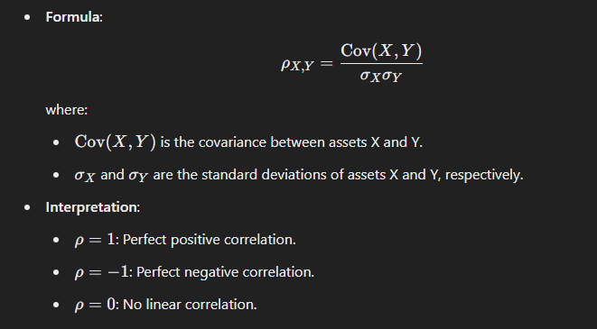
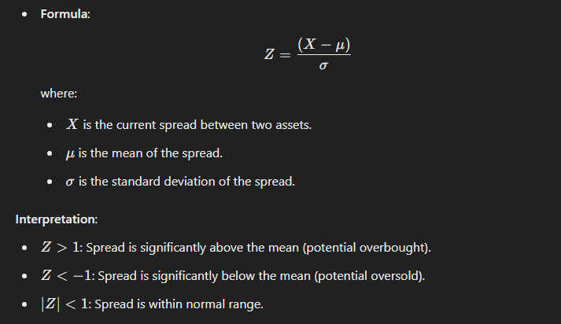
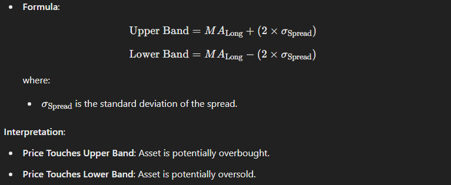
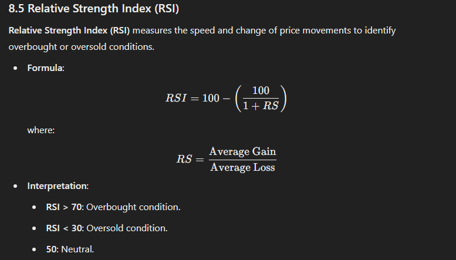
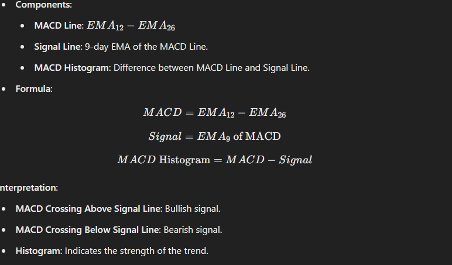

# Statistical Arbitrage Showdown 📊⚖️

**[](https://github.com/shashoriginal/Statistical-Arbitrage-Showdown/blob/main/LICENSE.md)**

**Statistical Arbitrage Showdown 📊⚖️** is a **world-class**, **highly advanced**, and **extremely engaging** interactive game developed using **Streamlit**. Designed for aspiring Quantitative Finance professionals, this application simulates a dynamic trading environment where players engage in statistical arbitrage strategies across multiple assets and rounds. Featuring sophisticated statistical indicators, interactive visualizations, comprehensive leaderboards, and a robust game mechanics system, **Statistical Arbitrage Showdown** offers an unparalleled educational and competitive experience.

---

## 📖 Table of Contents

1. [📌 Table of Contents](#-table-of-contents)
2. [🚀 Introduction](#-introduction)
3. [🔍 Features](#-features)
4. [🛠️ Installation](#️-installation)
5. [💻 Usage](#-usage)
6. [🎮 Game Mechanics](#-game-mechanics)
    - [6.1 Rounds and Market Conditions](#61-rounds-and-market-conditions)
    - [6.2 Asset Selection](#62-asset-selection)
    - [6.3 Decision Making](#63-decision-making)
7. [🏆 Scoring System](#-scoring-system)
8. [📐 Mathematical Concepts](#-mathematical-concepts)
    - [8.1 Moving Averages (MA)](#81-moving-averages-ma)
    - [8.2 Correlation Coefficient](#82-correlation-coefficient)
    - [8.3 Z-Score](#83-z-score)
    - [8.4 Bollinger Bands](#84-bollinger-bands)
    - [8.5 Relative Strength Index (RSI)](#85-relative-strength-index-rsi)
    - [8.6 Moving Average Convergence Divergence (MACD)](#86-moving-average-convergence-divergence-macd)
9. [📊 Visualizations](#-visualizations)
    - [9.1 Asset Price Movements with Indicators](#91-asset-price-movements-with-indicators)
    - [9.2 Capital Over Time](#92-capital-over-time)
    - [9.3 Asset Correlation Heatmap](#93-asset-correlation-heatmap)
    - [9.4 Z-Score Distribution](#94-z-score-distribution)
    - [9.5 Decision Impact on Capital](#95-decision-impact-on-capital)
10. [📈 Leaderboards](#-leaderboards)
11. [🧩 Future Enhancements](#-future-enhancements)
12. [🤝 Contributing](#-contributing)
13. [📜 License](#-license)
14. [📫 Contact](#-contact)

---

## 🚀 Introduction

Welcome to **Statistical Arbitrage Showdown 📊⚖️**, an interactive game designed to immerse players in the world of Quantitative Finance through the lens of statistical arbitrage. This application leverages advanced statistical indicators, real-time simulations, and engaging visualizations to provide a comprehensive learning and competitive environment.

**Statistical Arbitrage Showdown** is ideal for students, educators, and finance enthusiasts aiming to deepen their understanding of quantitative trading strategies, risk management, and market analysis.

---

## 🔍 Features

- **Interactive Gameplay**: Engage in up to 15 rounds of trading across five distinct assets.
- **Advanced Statistical Indicators**: Utilize Moving Averages, Correlation Coefficients, Z-Scores, Bollinger Bands, RSI, and MACD for informed decision-making.
- **Dynamic Visualizations**: Access a suite of interactive plots, including heatmaps, distribution charts, and capital progression graphs.
- **Comprehensive Leaderboards**: Track your performance against other players in real-time.
- **Robust Game Mechanics**: Experience realistic market simulations with varying conditions such as Bull, Bear, Volatile, and Stable markets.
- **Risk Management**: Adjust risk levels to influence potential rewards and penalties.
- **Detailed Analytics**: Gain insights into your trading strategies and outcomes through extensive data tracking.

---

## 🛠️ Installation

To set up and run **Statistical Arbitrage Showdown 📊⚖️** locally, follow these steps:

### 1. Clone the Repository

```bash
git clone https://github.com/shashoriginal/Statistical-Arbitrage-Showdown.git
cd Statistical-Arbitrage-Showdown
```

### 2. Create a Virtual Environment (Recommended)

It's advisable to use a virtual environment to manage dependencies.

```bash
python3 -m venv venv
source venv/bin/activate  # On Windows: venv\Scripts\activate
```

### 3. Install Dependencies

Ensure you have `pip` installed, then run:

```bash
pip install -r requirements.txt
```

### 4. Initialize JSON Files

The application uses JSON files to store game states and leaderboards. These files are automatically created if they don't exist. Ensure the directory has write permissions.

- `game_states.json`: Stores the state of each game session.
- `leaderboards.json`: Maintains leaderboards for each Game Code.

### 5. Run the Streamlit App

```bash
streamlit run app.py
```

### 6. Access the Application

Open your web browser and navigate to the URL provided in the terminal (typically `http://localhost:8501`).

---

## 💻 Usage

1. **Join a Game Session**:
    - **Enter Your Name**: Input your desired player name in the sidebar.
    - **Select a Game Code**: Choose from predefined Game Codes (e.g., `FINANCE2024`, `ARBITRAGEX`, `GROUPA`).
    - **Click "Join Game"**: This action registers you in the selected game session.

2. **Engage in Rounds**:
    - **View Round Information**: Current round number, market conditions, and your financial metrics.
    - **Select Asset Pair**: Choose two assets for arbitrage based on statistical indicators.
    - **Make Decisions**: Decide to **Go Long**, **Go Short**, or **Hold**, and set your risk level.
    - **Execute Decision**: Submit your choice and observe the outcome affecting your capital and score.

3. **Monitor Performance**:
    - **Visual Insights**: Utilize various plots to analyze asset movements and your trading impact.
    - **Track Leaderboards**: Compare your performance against other players in real-time.

4. **Game Conclusion**:
    - **Review Final Standings**: Upon completing all rounds, view your final score and position on the leaderboard.
    - **Analyze Decisions**: Examine detailed graphs illustrating the impact of your trading strategies.

---

## 🎮 Game Mechanics

### 6.1 Rounds and Market Conditions

- **Number of Rounds**: 15 per game session.
- **Market Conditions**: Each round is influenced by one of the following market conditions:
    - **Stable Market**: Minimal price fluctuations.
    - **Volatile Market**: High price variability.
    - **Bull Market**: General upward trend in asset prices.
    - **Bear Market**: General downward trend in asset prices.

Market conditions are randomly assigned with the following probabilities:
- **Stable Market**: 30%
- **Volatile Market**: 40%
- **Bull Market**: 20%
- **Bear Market**: 10%

### 6.2 Asset Selection

- **Number of Assets**: Five distinct assets (`Asset A`, `Asset B`, `Asset C`, `Asset D`, `Asset E`).
- **Asset Pairs**: Players select pairs of assets to perform arbitrage based on statistical indicators.
- **Asset Prices**: Each asset has an initial price, updated each round based on market conditions.

### 6.3 Decision Making

Players make decisions each round, choosing to:

- **🔼 Go Long**: Bet that the asset pair will increase in value.
- **🔽 Go Short**: Bet that the asset pair will decrease in value.
- **⏸️ Hold**: Take no action.

**Risk Level**: Players select a risk level (1-10), influencing potential rewards and penalties.

**Decision Execution**:
- **Successful Arbitrage**:
    - Occurs if conditions align with the player's action (e.g., `Go Long` with a positive Z-Score).
    - **Reward**: `Risk Level * 1500`
    - **Score Increase**: `Reward / 150`
- **Failed Arbitrage**:
    - Occurs if conditions do not align with the player's action.
    - **Penalty**: `Risk Level * 700`
    - **Penalty Accumulation**: Increases player's total penalties.

Players' capital and scores are updated based on the outcome of their decisions.

---

## 🏆 Scoring System

The scoring system in **Statistical Arbitrage Showdown 📊⚖️** is meticulously designed to reflect both the profitability and risk associated with each player's trading decisions. Below is a detailed breakdown of how scores are calculated and updated throughout the game.

### 7.1 Components of the Scoring System

1. **Rewards**:
    - **Condition**: Awarded when a player's decision aligns with the market outcome.
        - **🔼 Go Long**: Successful if the Z-Score > 1.
        - **🔽 Go Short**: Successful if the Z-Score < -1.
    - **Calculation**:
        - `Reward = Risk Level * 1500`
    - **Score Increment**:
        - `Score Increase = Reward / 150`
    - **Example**:
        - **Risk Level**: 5
        - **Reward**: `5 * 1500 = $7,500`
        - **Score Increase**: `7500 / 150 = 50`

2. **Penalties**:
    - **Condition**: Imposed when a player's decision does not align with the market outcome.
    - **Calculation**:
        - `Penalty = Risk Level * 700`
    - **Score Impact**:
        - Penalties are subtracted from the player's total penalties, which indirectly affect the final score (`Score - Penalties`).
    - **Example**:
        - **Risk Level**: 3
        - **Penalty**: `3 * 700 = $2,100`
        - **Penalty Accumulation**: `$2,100` added to total penalties.

3. **Final Score**:
    - At the end of the game, the final score is calculated as:
        - `Final Score = Total Score - Total Penalties`
    - This metric reflects both the player's successful trades and the impact of any failed arbitrage attempts.

### 7.2 Scoring Flow

1. **Initialization**:
    - **Capital**: Each player starts with `$200,000`.
    - **Score**: Initialized at `0`.
    - **Penalties**: Initialized at `0`.

2. **During Each Round**:
    - Players make a trading decision with an associated risk level.
    - Based on the outcome:
        - **Successful Arbitrage**:
            - Capital increases by the reward amount.
            - Score increases by the calculated score increment.
        - **Failed Arbitrage**:
            - Capital decreases by the penalty amount.
            - Penalties accumulate.
    - Capital history is updated after each decision.

3. **End of Game**:
    - Final score is computed by subtracting total penalties from the total score.
    - Leaderboards display players ranked by their final scores and capital.

### 7.3 Example Scenario

| Round | Action      | Risk Level | Z-Score | Outcome         | Reward  | Penalty | Score | Penalties | Capital  |
|-------|-------------|------------|---------|-----------------|---------|---------|-------|-----------|----------|
| 1     | 🔼 Go Long  | 5          | 1.2     | Successful      | $7,500  | $0      | +50   | $0        | $207,500 |
| 2     | 🔽 Go Short | 3          | -0.8    | Failed          | $0      | $2,100  | +50   | $2,100    | $205,400 |
| 3     | ⏸️ Hold     | 4          | 0       | No Action       | $0      | $0      | +50   | $2,100    | $205,400 |
| ...   | ...         | ...        | ...     | ...             | ...     | ...     | ...   | ...       | ...      |

**Final Score**: `Total Score - Total Penalties = 50 - 2,100 = -2,050`

---

## 📐 Mathematical Concepts

Understanding the mathematical underpinnings of the statistical indicators used in **Statistical Arbitrage Showdown 📊⚖️** is crucial for leveraging them effectively. Below is an in-depth explanation of each mathematical concept implemented in the game.

### 8.1 Moving Averages (MA)

**Moving Averages** smooth out price data to identify trends over specified periods.

- **Short-Term Moving Average (MA Short)**:
    - **Period**: 5 days
    - **Purpose**: Captures short-term price movements.
    - **Calculation**:


        
- **Long-Term Moving Average (MA Long)**:
    - **Period**: 20 days
    - **Purpose**: Captures long-term price trends.
    - **Calculation**:


**Usage in Game**:
- **Trend Identification**: Comparing MA Short and MA Long helps in identifying bullish or bearish trends.
- **Bollinger Bands**: MA Long is used as the central line for Bollinger Bands.

### 8.2 Correlation Coefficient

**Correlation Coefficient** measures the strength and direction of a linear relationship between two assets.




**Usage in Game**:
- **Arbitrage Opportunities**: High positive or negative correlations indicate potential for arbitrage strategies.

### 8.3 Z-Score

**Z-Score** quantifies the number of standard deviations a data point is from the mean.


**Usage in Game**:
- **Decision Trigger**: Determines whether to **Go Long** or **Go Short** based on the spread's deviation from the mean.

### 8.4 Bollinger Bands

**Bollinger Bands** consist of a middle band (MA Long) and two outer bands representing standard deviations from the mean.



**Usage in Game**:
- **Risk Assessment**: Helps in assessing the volatility and potential reversal points for the asset pair.

### 8.5 Relative Strength Index (RSI)

**Relative Strength Index (RSI)** measures the speed and change of price movements to identify overbought or oversold conditions.



**Usage in Game**:
- **Trend Confirmation**: Confirms the strength of a trend indicated by other indicators.

### 8.6 Moving Average Convergence Divergence (MACD)

**MACD** is a trend-following momentum indicator that shows the relationship between two moving averages of an asset’s price.



**Usage in Game**:
- **Momentum Assessment**: Evaluates the momentum behind price movements, aiding in decision-making.

---

## 📊 Visualizations

**Statistical Arbitrage Showdown 📊⚖️** employs a variety of interactive visualizations to provide players with comprehensive insights into their trading strategies and market dynamics.

### 9.1 Asset Price Movements with Indicators

- **Description**: Displays the price movements of the selected asset pair over the simulated period, overlaid with Moving Averages and Bollinger Bands.
- **Components**:
    - **Price Lines**: Visual representation of asset prices.
    - **Moving Averages**: Short-term and long-term MAs plotted as dashed lines.
    - **Bollinger Bands**: Upper and lower bands indicating volatility.

**Sample Plot**:


### 9.2 Capital Over Time

- **Description**: Illustrates the progression of the player's capital throughout the game rounds.
- **Components**:
    - **Capital Line**: Tracks changes in capital after each decision.

**Sample Plot**:


### 9.3 Asset Correlation Heatmap

- **Description**: Visualizes the correlation matrix of all assets, highlighting the strength and direction of relationships.
- **Components**:
    - **Heatmap**: Color-coded matrix representing correlation coefficients.
    - **Asset Labels**: Identifies each asset on the axes.

**Sample Plot**:


### 9.4 Z-Score Distribution

- **Description**: Displays the distribution of Z-Scores from the player's trading decisions, providing insights into the frequency and magnitude of spread deviations.
- **Components**:
    - **Histogram**: Frequency of Z-Scores across decisions.

**Sample Plot**:


### 9.5 Decision Impact on Capital

- **Description**: Shows the cumulative impact of each decision (rewards and penalties) on the player's capital.
- **Components**:
    - **Bar Chart**: Differentiates between rewards (green) and penalties (red) across rounds.

**Sample Plot**:


---

## 📈 Leaderboards

Leaderboards provide a competitive aspect to **Statistical Arbitrage Showdown 📊⚖️**, allowing players to compare their performance against peers in real-time.

### 10.1 Real-Time Updates

- **Functionality**: Leaderboards update instantly after each player's decision, reflecting the latest standings based on scores and capital.
- **Components**:
    - **Player Rankings**: Ordered list of players based on `Final Score` and `Capital`.
    - **Detailed Statistics**: Includes `Score`, `Capital`, `Penalties`, and `Decisions Made` for each player.

**Sample Leaderboard**:

| Player     | Score | Capital ($) | Penalties ($) | Decisions Made |
|------------|-------|-------------|---------------|-----------------|
| Alice      | 1200  | 220,000     | 300           | 10              |
| Bob        | 1100  | 215,000     | 400           | 12              |
| Charlie    | 1050  | 210,000     | 500           | 11              |

### 10.2 Final Leaderboard

At the end of the game, a final leaderboard summarizes the overall performance of all participants, fostering a competitive environment and encouraging players to refine their strategies.


## 🤝 Contributing

Contributions are welcome! To make **Statistical Arbitrage Showdown 📊⚖️** even more robust and feature-rich, feel free to contribute by following these guidelines:

1. **Fork the Repository**: Create a personal fork of the project on GitHub.

2. **Create a Feature Branch**: 
    ```bash
    git checkout -b feature/YourFeatureName
    ```

3. **Commit Your Changes**:
    ```bash
    git commit -m "Add Your Feature Description"
    ```

4. **Push to the Branch**:
    ```bash
    git push origin feature/YourFeatureName
    ```

5. **Open a Pull Request**: Navigate to the original repository and open a pull request detailing your changes.


## 📜 License

This project is licensed under the [MIT License](https://github.com/shashoriginal/Statistical-Arbitrage-Showdown/blob/main/LICENSE.md). You are free to use, modify, and distribute this software as per the terms outlined in the license.

---

## 📫 Contact

For any inquiries, feedback, or support, please reach out to:

- **Shashank**
    - **GitHub**: [@shashoriginal](https://github.com/shashoriginal)

Feel free to open an [issue](https://github.com/shashoriginal/Statistical-Arbitrage-Showdown/issues) on GitHub for any questions or assistance.

---

**Statistical Arbitrage Showdown 📊⚖️** is developed with ❤️ by [Shashank](https://github.com/shashoriginal). Empowering the next generation of Quantitative Finance professionals.


## 🔗 Useful Links

- **Streamlit Documentation**: [https://docs.streamlit.io](https://docs.streamlit.io)
- **Plotly Documentation**: [https://plotly.com/python/](https://plotly.com/python/)
- **Pandas Documentation**: [https://pandas.pydata.org/docs/](https://pandas.pydata.org/docs/)
- **NumPy Documentation**: [https://numpy.org/doc/](https://numpy.org/doc/)
- **SciPy Documentation**: [https://docs.scipy.org/doc/](https://docs.scipy.org/doc/)

---

## 📝 Acknowledgements

- Inspired by the dynamic field of Quantitative Finance and the educational needs of aspiring finance professionals.
- Utilizes powerful Python libraries such as **Streamlit**, **Pandas**, **NumPy**, **SciPy**, and **Plotly** to deliver a seamless and interactive user experience.

---
